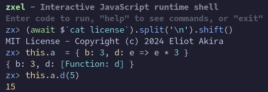

# zxel

`zxel` is an interactive terminal shell for JavaScript runtimes with syntax highlight and `zx` utilities.



## Usage

Prerequisites: [Node](https://nodejs.org/en/) (version 18 or above)

```sh
npx zxel
```

Alternatively, with [Bun](https://bun.sh/).

```sh
bunx zxel
```

## Features

- Read-eval-print-loop of JavaScript expression
- Syntax highlight using [`emphasize`](https://github.com/wooorm/emphasize)
- [Keyboard shortcuts](#keyboard-shortcuts) similar to `readline`
- Top-level `await`
- Globals from [`zx`](https://google.github.io/zx/api)
- Runs with Bun or Deno if installed

## Environment

Assign variables on `this` to make it available for subsequent lines of code.

```js
this.a = 123
```

Then it can be used as a global variable.

```js
a + 456
```

Using `let` or `const` to define a variable doesn't work currently, because every line is evaluated in its own function scope. This might change in the future if the input code is parsed and processed.

Global utilities like `fs` and `glob` are also defined on `this`. For example, to see a list:

```js
Object.keys(this).sort()
```

### Globals

Utilities from [`zx`](https://google.github.io/zx/api) are defined as global variables.

- `$` - Run shell command with return value
  ```js
  const text = await $`cat readme.md`
  const files = (await $`ls -1`).split('\n')
  ```
- `$see` - Run shell command with console output
  ```js
  await $see`ls -1`
  ```
- `cd` - Change directory
- `fetch` - Fetch
- `fs` - File system utilities from [`fs-extra`](https://github.com/jprichardson/node-fs-extra)
- `glob` - Pattern match files using [`globby`](https://github.com/sindresorhus/globby)
  ```js
  for (const file of await glob('*.txt')) {
    console.log(file)
  }
  ```
- `globDir` - Pattern match directories
- `os` - OS info from [`os`](https://nodejs.org/api/os.html)
- `path` - Path utilities from [`path`](https://nodejs.org/api/path.html)

Also [globals from Node](https://nodejs.org/api/globals.html); or [globals from Bun](https://bun.sh/docs/api/globals) with [`Database`](https://bun.sh/docs/api/sqlite) and `db`, a database instance at `~/.zxel/db.sqlite`.

Modules can be dynamically imported with `await import()`.

## Keyboard shortcuts

| Shortcut               | Action                            |
| ---------------------- | --------------------------------- |
| `Enter`                | Run code                          |
| `Escape`               | Cancel                            |
| `→`                    | Forward one character             |
| `Ctrl`+`→`             | Forward one word                  |
| `←`                    | Backward one character            |
| `Ctrl`+`←`             | Backward one word                 |
| `Home`, `Ctrl`+`A`     | Beginning of line                 |
| `End`, `Ctrl`+`E`      | End of line                       |
| `↓`                    | Next line in history              |
| `↑`                    | Previous line in history          |
| `Ctrl`+`C`             | Exit shell                        |
| `Backspace`            | Delete previous character         |
| `Delete`               | Delete next character             |
| `Ctrl`+`L`             | Clear screen                      |

## TODO

- Multiline mode

## References

- [ANSI Escape Sequences](https://gist.github.com/fnky/458719343aabd01cfb17a3a4f7296797)
